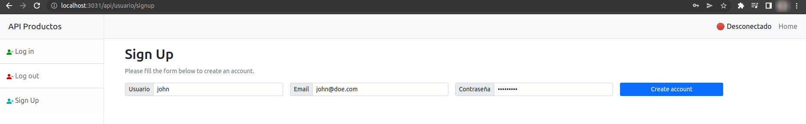
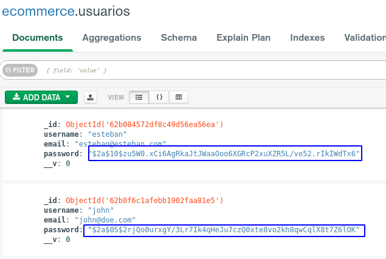
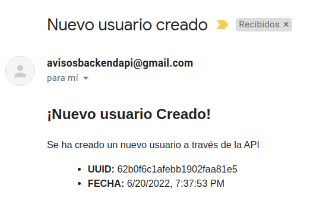

# Desafío 18
Lo mismo que he acumulado más lo definido aquí abajo
----

## Registro de usuarios y aviso por email de la operación

- Creamos un nuevo usuario

- Observamos que se ha creado un nuevo documento en nuestra base de Mongo, además la contraseña está encriptada

- Recibimos un correo electrónico informando el UUID y fecha en la que se ha generado este usuario.

