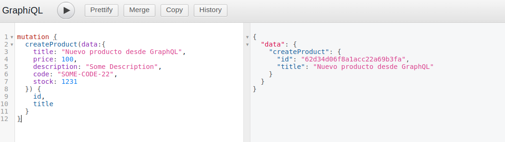
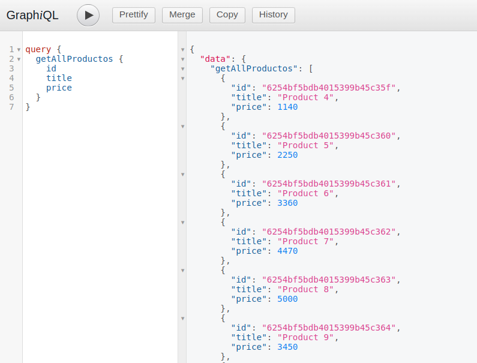

# Desafío 22

## Reformar para usar GraphQL

### Consignas

- En base al último proyecto entregable de servidor API RESTful, reformar la capa de routeo y el controlador para que los requests puedan ser realizados a través del lenguaje de query GraphQL.
- Si tuviésemos un frontend, reformarlo para soportar GraphQL y poder dialogar apropiadamente con el backend y así realizar las distintas operaciones de pedir, guardar, actualizar y borrar recursos.
- Utilizar GraphiQL para realizar la prueba funcional de los querys y las mutaciones.

----

En la carpeta `graphql`, dentro de src se crearon todos los archivos necesarios para utilizar **GraphQL**.
```console
graphql
├── inputs
│   ├── ProductoNew.input.js
│   └── ProductoUpdate.input.js
├── mutations
│   ├── CreateCarrito.mutation.js
│   ├── CreateProducto.mutation.js
│   ├── DeleteCarritoById.mutation.js
│   ├── DeleteProductById.mutation.js
│   ├── DeleteProductFromCart.mutation.js
│   ├── SaveProductToCart.mutation.js
│   └── UpdateProductById.mutation.js
├── queries
│   ├── GetAllCarritos.query.js
│   ├── GetAllProductos.query.js
│   ├── GetAllProductsFromCartById.query.js
│   └── GetProductById.query.js
├── Schema.js
└── types
    ├── Carrito.type.js
    └── Producto.type.js
```

Para acceder a GraphiQL ingresa a

### `http://localhost:3031/graphql`

#### Ejemplo de una mutación (crear un nuevo producto)



#### Ejemplo de una query

