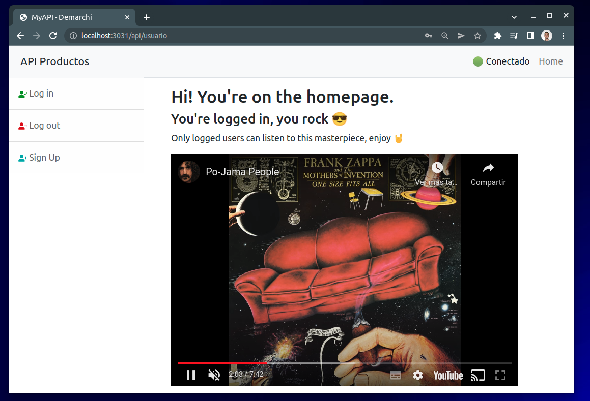
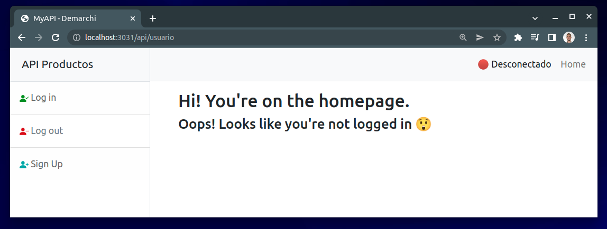
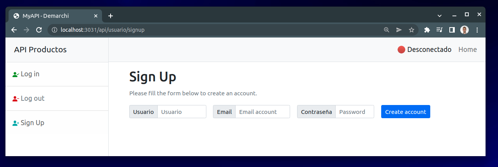
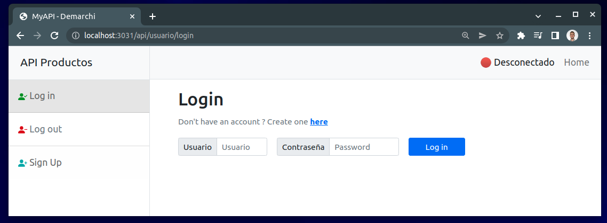
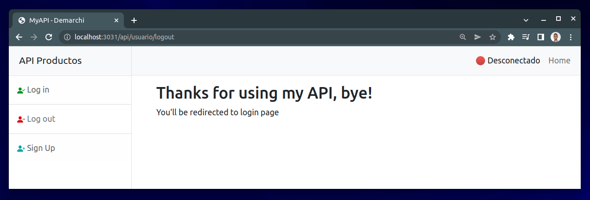

# Entrega Final

## Login, Logout y SignUp de usuario

### Home

En `/api/usuario`

- ✅ Si el usuario se encuentra loggeado:

- ❌ Si el usuario **no** se encuentra loggeado:

### Sign Up

En `/api/usuario/signup`

💡 Si se tiene configurada la cuenta de gmail y quitando el comentario de `user.controller.js:28` se recibirá un correo electrónico de que se ha creado un nuevo usuario.

### Log in

En `/api/usuario/login`

### Log out

En `/api/usuario/logout`

## Login con Facebook

Implementado en entrega anterior, para ello ver: [Entrega 13 - Inicio de sesión con Facebook](https://github.com/EstebanDem/backend-coderhouse/tree/master/Entrega-13#readme)

## Testing

Mismos tests que antes, para ver más detalles ver: [Entrega 21 - Testeamos nuestra API](https://github.com/EstebanDem/backend-coderhouse/tree/master/Entrega-21#readme)

